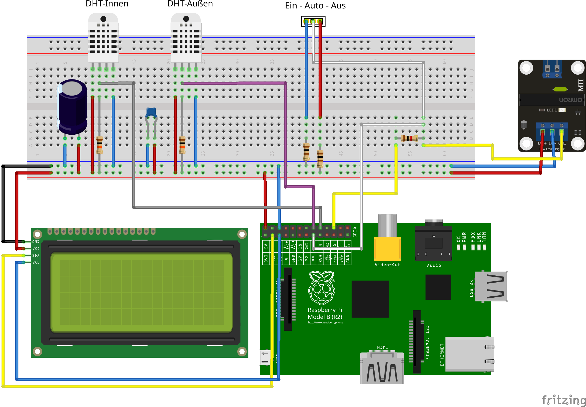
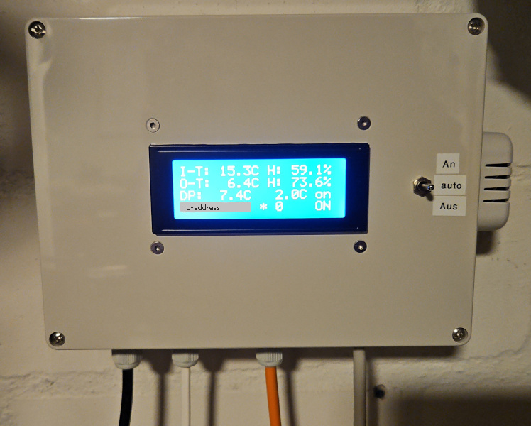
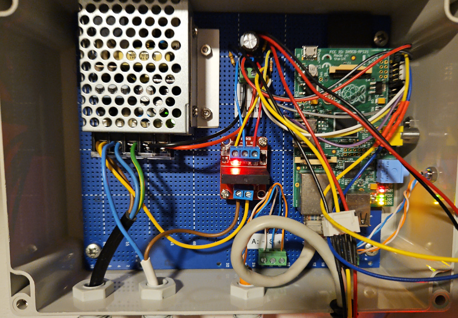
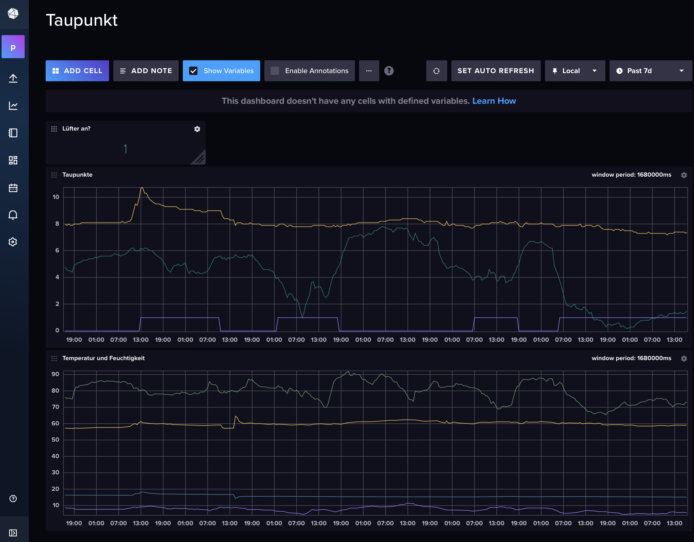
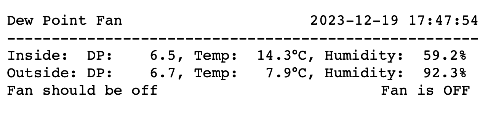
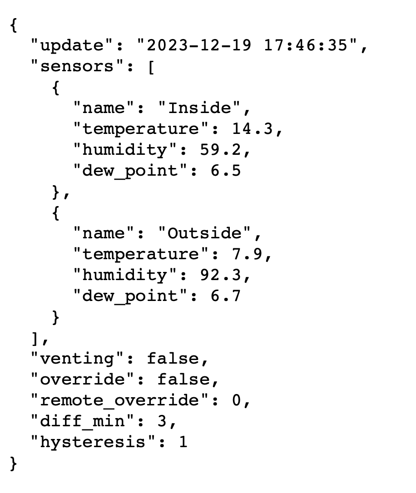

# Dew point fan controller

This project is a GO/RaspberryPI version of the [Taupunktlüfter](https://github.com/MakeMagazinDE/Taupunktluefter)
project from the German **Make** magazine. The original project use C/C++ on an Arduino Nano.

My dew point fan controller is in many aspects the same as the original project:
- same power supply
- same sensors
- same display
- same case
- same fan

Differences:
- Raspberry PI 2
- Solid state relais
- software written in GO
- no need for extra ethernet connection board
- no need for extra real time clock or SD card reader

I've done this, because I had an old Raspberry PI lying around
and I thought it's convenient to have an ethernet connection right from the start.

I use this ethernet connection to access the little http server to see the readings
in a browser. In addition, the measured temperatures, humidity values and calculated
dew points are sent to an InfluxDB time series database. There I have a little dashboard
configured that shows me the values over time.

There's also a [companion app made with flutter](https://github.com/aluedtke7/dew-point-fan-app) 
that runs on Android, iOS, Windows, macOS and Linux. This app shows the current temperatures, humidity
values and the status of the fan. In addition, it can override the fan status to switch it on or off.

## Screenshots and photos
Fritzing schematic:
<p float="left">
    
</p>

Hardware photos:
<p float="left">
    
    
</p>

Screenshots:
<p float="left">
    
    
    
</p>

## Start programm automatically
In order to start the programm when the Raspberry Pi boots up, you need to paste the following lines to `/etc/rc.local` 
**before** the line containing `exit 0`!
Please adjust the exported values to your need. The InfluxDB token is created in the UI of
InfluxDB. Look for **API Tokens**.

The url has to be set to the right ip-address of your InfuxDB server including the used
port, if you use a non standard port. I run InfluxDB in a docker container on my NAS and
there I have to use a special port.

````
export INFLUX_DP_TOKEN=FJGkvqQ...LPhKA==
export INFLUX_SRV_URL=http://192.168.0.22:8086
su pi -c '/home/pi/dew_point_fan/dew_point_fan'
````

I use the user **pi** on the Raspberry and the program is located in the sub folder 
`dew_point_fan` of the home folder of pi.

## Development
Please read chapter [Final solution: compile on Raspberry](#final-solution) if you want
to compile it yourself. The following chapter is a another possibility to build the binary.

### Cross compilation
Cross Compilation is possible, but you have to install a special ARM compiler.

> Important
> The DHT Package needs a special arm compiler and build tools. The details are
> described here: [https://github.com/d2r2/go-dht/issues/20](https://github.com/d2r2/go-dht/issues/20)

#### Using special version of go-dht
The latest versions of go-dht will lead in binaries that need root priviledge to 
read/write the GPIO pins. There is a fix for this, but that's not yet merged. The 
following version does help in this case:

    go get github.com/d2r2/go-dht@42fe873fbabb

I created a fork of this project with the mentioned fix included:
[special go-dht](https://github.com/aluedtke7/go-dht)

On your development machine run the following line to build a `dew_point_fan` binary that
can run on a raspberry pi:

    CC=arm-linux-gnueabihf-gcc CGO_ENABLED=1 GOOS=linux GOARCH=arm GOARM=6 go build -o dew_point_fan -v dew_point_fan.go

This will create a binary named `dew_point_fan` that can run on an ARM processor 
running linux.

#### Copy binary to raspberry
If your ssh key is present on the raspberry, you don't need credentials to copy the binary:

    scp dew_point_fan pi@192.168.0.29:

or both commands in one go:

    GOOS=linux GOARCH=arm go build -o dew_point_fan -v dew_point_fan.go && scp dew_point_fan pi@192.168.0.29:

### Final solution: compile on Raspberry
Even though I'm using Manjaro as development machine, I was able to cross compile my code
without erros. But when I ran this code on a my Raspberry, I got an error about a GBLIC 
version mismatch.

Normally, cross compilation is very easy with GO, but in this case I decided to compile 
the code directly on the Raspberry. On this old Raspberry, the compilation time for this
is approx. 1 minute. This is very slow compared to running GO on a laptop, but I can live
with it.

> **Important**
> 
> My Raspberry has a single core and only 512MB RAM. When I tried to compile the sources, 
> I got an error message `go build github.com/influxdata/line-protocol: ... signal: killed`.
>  I had to increase the size of the swapfile:
> ````
> sudo nano /etc/dphys-swapfile
> # inside this file, change the value of CONF_SWAPSIZE to 2048
> sudo dphys-swapfile setup
> sudo dphys-swapfile swapon
> ````
> With this modification, I can compile the sources.


